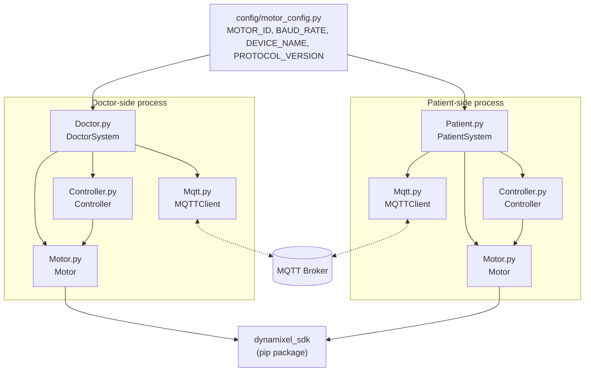
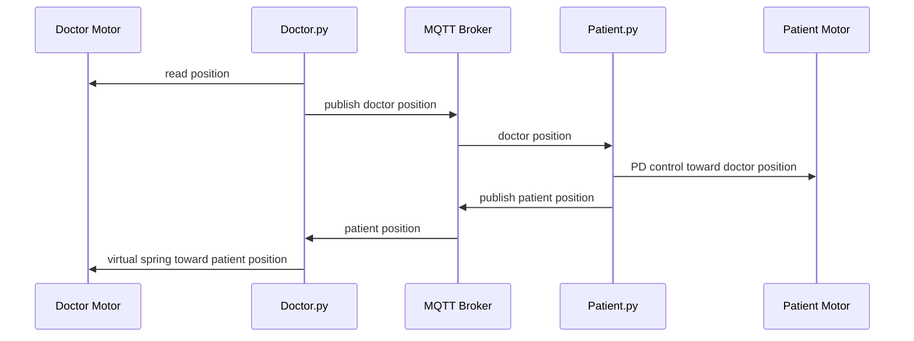

# Wrist Rehabilitation Robot

**Teleoperated, force-feedback wrist rehabilitation: a therapist's motion is mirrored to a patient-side actuator in real time, with resistance fed back the other way.**

[](https://github.com/ookkshirsagar/Wrist_Rehabilitation/actions/workflows/ci.yml)
[](LICENSE)

---

## Overview

Two identical rigs, one at the therapist's side and one at the patient's, each built around a Dynamixel actuator in Current-based Position Control Mode. The link between them is MQTT, not a wire:

- **Doctor System**: reads the therapist's wrist position and publishes it. It also pulls its own motor toward the patient's last reported position when the patient lags, a virtual spring that lets the therapist feel resistance from the patient side, not just one-way mirroring.
- **Patient System**: subscribes to the doctor's position and drives its own motor to track it with PD control, publishing its own position back.

Every control cycle on both sides is gated by temperature, current, and position limits before torque is applied.

---

## Architecture

### Module structure

Each entrypoint composes the same three building blocks. `Controller` is the
only module that talks to `Motor` directly, `Doctor.py`/`Patient.py` never
touch motor registers themselves:



### Runtime message flow



---

## Key Features

1. **Bidirectional teleoperation**
   The Patient System mirrors the Doctor's wrist movement; the Doctor System feeds back resistance toward the Patient's actual position, so lag or obstruction on the patient side is felt by the therapist.

2. **Current-based Position Control Mode**
   Force-based control, enabling adjustable resistance or assistive torque for wrist movements.

3. **Safety Mechanisms**
   Temperature, position, and current limits enforced on every control cycle, on both sides independently.

4. **Customizable Motion Profiles**
   Smooth, precise, controlled wrist movements with adjustable acceleration and velocity settings.

5. **Modular Design**
   Clear separation of hardware control (Motor), task coordination (Controller), and communication (MQTT), each independently testable.

---

## Hardware

Built and tuned for a Dynamixel XM540-W270 actuator (Protocol 2.0). Control table addresses and range-of-motion values are documented in [`literature/literature.md`](literature/literature.md); the short version:

- Operating mode: Current-based Position Control (mode 5)
- Range of motion: 83 degrees flexion, 81 degrees extension (normal wrist ROM is roughly 73/71 degrees; the wider range leaves a safety margin rather than being the operating target)
- Reference: [XM540-W270 control table](https://emanual.robotis.com/docs/en/dxl/x/xm540-w270/#control-table-data-address)

---

## Project Structure

```
Wrist_Rehabilitation/
│
├── Motor.py            # Low-level motor operations
├── Controller.py        # High-level task coordination for rehabilitation
├── Doctor.py             # Entrypoint for Doctor-side wrist control
├── Patient.py            # Entrypoint for Patient-side wrist control
├── Mqtt.py               # MQTT module for system communication
├── config/
│   └── motor_config.py   # Motor-specific configuration values
├── tests/
│   ├── conftest.py               # Shared pytest fixtures
│   ├── test_motor.py             # Motor unit tests, mocked hardware
│   ├── test_controller.py        # PD control loop unit tests
│   ├── test_safety.py            # Doctor/Patient safety-check unit tests
│   └── hardware/                 # Manual scripts requiring real hardware
│       ├── motor_integration_check.py
│       └── controller_operations_check.py
├── literature/
│   └── literature.md     # Design decisions, control table reference, ROM values
├── .env.example           # Template for local MQTT credentials
├── requirements.txt        # Runtime dependencies
├── requirements-dev.txt    # Test dependencies
├── pytest.ini
├── LICENSE
└── README.md
```

Logs are written at runtime to `data/logs/` (created automatically, not committed).

---

## Installation and Setup

### Prerequisites

- Python 3.8+
- A Dynamixel motor reachable over serial (e.g. `/dev/ttyUSB0` on Linux) to actually operate the hardware. The automated test suite does not require this.

### Installation Steps

1. Clone this repository:
   ```bash
   git clone https://github.com/ookkshirsagar/Wrist_Rehabilitation.git
   cd Wrist_Rehabilitation
   ```

2. Create a virtual environment and install dependencies:
   ```bash
   python3 -m venv venv
   source venv/bin/activate        # Linux / macOS
   venv\Scripts\activate           # Windows PowerShell

   pip install -r requirements.txt
   ```

3. Configure MQTT credentials. The broker host, username, and password are read from the environment, never hardcoded:
   ```bash
   cp .env.example .env
   # then edit .env with your actual HiveMQ (or other broker) credentials
   ```

4. Verify that the necessary serial ports are accessible for the Dynamixel motors:
   ```bash
   sudo chmod a+rw /dev/ttyUSB0
   ```

---

## Usage Instructions

### Running the Systems
- **Doctor System**:
  ```bash
  python Doctor.py
  ```

- **Patient System**:
  ```bash
  python Patient.py
  ```

### Logs and Telemetry
Log files for debugging and system analysis are written to `data/logs/` at runtime: system initialization details, runtime data, and error reports.

---

## Running tests

The main test suite mocks the Dynamixel SDK and runs without any hardware attached:

```bash
pip install -r requirements-dev.txt
pytest -v
```

For manual checks against a real, connected motor, see `tests/hardware/`:

```bash
python tests/hardware/motor_integration_check.py
python tests/hardware/controller_operations_check.py
```

---

## Additional Resources

### Dynamixel SDK
Motor communication uses the [DynamixelSDK](https://github.com/ROBOTIS-GIT/DynamixelSDK) Python package (`dynamixel_sdk` on PyPI), installed via `requirements.txt`, not vendored in this repository.

### Literature
[`literature/literature.md`](literature/literature.md) documents the design rationale in detail, including:
- Dynamixel control table parameters used
- Choice of Current-based Position Control Mode
- Safety mechanisms and their thresholds
- Wrist range-of-motion values and their source

---

## Contribution Guidelines

Contributions are welcome. Please:
1. Fork this repository.
2. Create a new branch for your feature or fix.
3. Run `pytest -v` and make sure it passes.
4. Submit a pull request for review.

For any questions or feedback, please raise an issue in the repository.

---

## License

[MIT](LICENSE)
